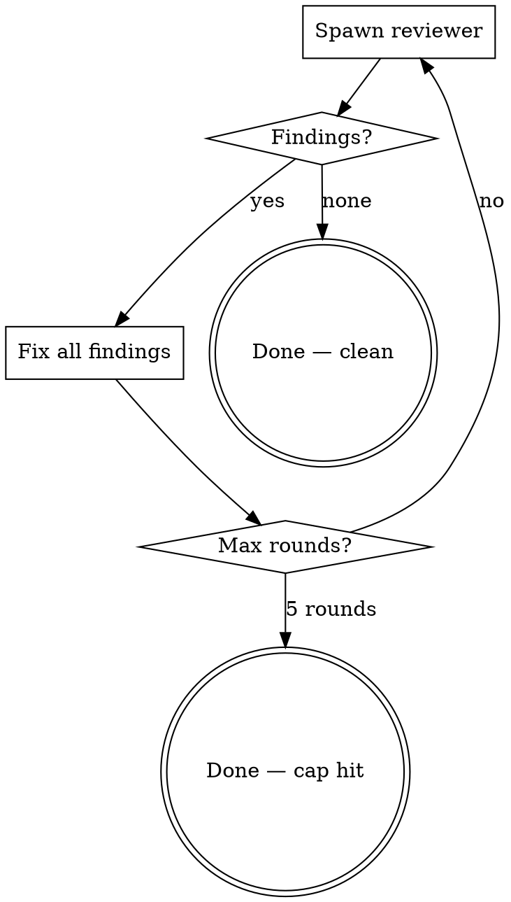

# Review-Fix Loop

Spawn a reviewer subagent, fix findings, re-review until clean. Max 5 rounds.

## Process



### 1. First review

Spawn `cavecrew-reviewer` with:

- Target file(s) and what to check
- Instruction to verify against actual codebase (not just the file in isolation)
- `run_in_background: false` (need results to proceed)
- **Do NOT use the Agent tool or spawn subagents.**

### 2. Fix

Read findings. Apply all fixes to the file(s). No partial fixes — address every finding before re-reviewing.

### 3. Re-review

Spawn `cavecrew-reviewer` again with:

- Same target file(s)
- List of what was fixed from previous round (so reviewer verifies fixes landed AND checks for new issues)
- Same instruction to verify against codebase
- **Do NOT use the Agent tool or spawn subagents.**

### 4. Repeat or exit

- **Clean (no findings):** Done. Report to user.
- **Findings remain:** Fix and re-review (go to step 2).
- **5 rounds reached:** Stop. Report remaining issues to user — something may need human judgment.

## Reviewer prompt template

```
[Review/Re-review] this [file type]: [path]

[First round: describe what to check]
[Re-review: list previous findings and which were fixed. Ask reviewer to verify fixes AND find new issues.]

Check against actual codebase, not just the file text.
[If clean, say "Clean — no issues."]

IMPORTANT: Do NOT use the Agent tool or spawn subagents.
```

## Key behaviors

- **Always run reviewer synchronously** (`run_in_background: false`) — need findings before fixing.
- **Fix ALL findings before re-review** — partial fixes waste review rounds.
- **Pass previous findings to re-reviewer** — reviewer needs context to verify fixes and avoid re-reporting.
- **Report round count** — tell user "Clean after N rounds" or "Stopped at 5 rounds, N issues remain."
- **Reviewer must NEVER spawn subagents** — always include "Do NOT use the Agent tool" in the prompt.
